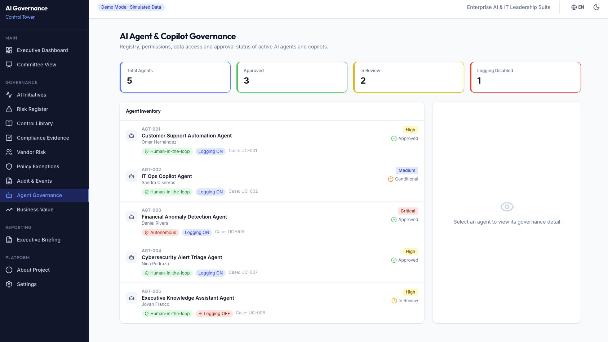

# AI Governance Control Tower

<div align="center">


**An executive portfolio demo for AI Governance — connecting AI use cases, risk, controls, evidence, vendors, agents, business value and executive decision-making.**

[Live Demo](https://ai-governance-control-tower.vercel.app) · [Report Issue](https://github.com/jovfranco-tech/ai-governance-control-tower/issues)

</div>

---

## 📌 Overview

**AI Governance Control Tower** operationalizes AI governance for enterprise organizations. It demonstrates how to move governance from static spreadsheets to a dynamic, integrated operational model — covering the full AI initiative lifecycle: intake, risk assessment, executive approval, control monitoring, audit preparation, vendor risk, agent governance, traceability and board-ready reporting.

> ⚠️ **Disclaimer:** This is a **portfolio project** using simulated enterprise data to demonstrate governance readiness and ISO/IEC 42001-aligned concepts. It is not a production-ready compliance platform, does not reproduce proprietary standard text, and does not replace legal or certified advisory.

---

## 💡 Why This Project Matters

Most AI governance tooling focuses on isolated data points. This project demonstrates a **connected operating model** — where every AI use case traces to its risks, controls, evidence, owner and governance decision. It bridges the gap between technical AI operations and executive accountability, proving readiness for regulations and frameworks like ISO/IEC 42001, EU AI Act and NIST AI RMF.

---

## 🎯 Who It's For

| Persona | Primary Focus |
|---|---|
| **Technology Executive** | AI portfolio posture, strategic risk and business value alignment |
| **Security & Risk (CISO-adjacent)** | Risk register, vendor risk, agent permissions, overdue controls |
| **AI Governance Lead** | Use case inventory, control library, traceability, policy exceptions |
| **Compliance / Audit** | Evidence tracker, audit readiness, overdue items, exception status |
| **Business Owner** | Initiative ROI, strategic alignment, risk-adjusted prioritization |

---

## 🗺️ Demo Flow

Recommended path for hiring managers, interviewers and executive reviewers:

1. **Executive Dashboard** — AI portfolio posture, KPIs, risk exposure and maturity snapshot.
2. **Committee View** — Decisions required, high-risk initiatives and governance priorities.
3. **AI Initiatives** — Use case inventory, risk tiers, owners and business context.
4. **Risk Register** — Risk scoring (L×I), categories, mitigation status and escalation flags.
5. **Control Library** — ISO/IEC 42001-aligned controls with maturity levels and evidence status.
6. **Compliance Evidence** — Audit artifact tracking, gaps and readiness score.
7. **Vendor Risk** — Third-party AI platform assessment, scoring and approval status.
8. **Agent Governance** — Autonomous agent permissions, data access and human-in-the-loop requirements.
9. **Business Value** — Risk-adjusted prioritization scatter plot and initiative value table.
10. **Governance Traceability** — Full chain: Use Case → Risk → Control → Evidence → Decision.
11. **Executive Briefing** — Board-ready governance memo with print and Markdown export.

---

## 🧩 Modules

| Module | Path | Description |
|---|---|---|
| **Executive Dashboard** | `/dashboard` | KPIs, portfolio status, risk exposure, maturity snapshot and demo personas |
| **Committee View** | `/committee` | Board-ready decision view for high-risk initiatives |
| **AI Initiatives** | `/use-cases` | Central inventory with risk tier, owner, governance decision and business value |
| **Risk Register** | `/risks` | Risk scoring (L×I), categories, mitigation status and escalation flags |
| **Control Library** | `/controls` | ISO/IEC 42001-aligned control catalog with maturity levels and evidence status |
| **Compliance Evidence** | `/evidence` | Audit artifact tracking, gaps, review status and readiness score |
| **Vendor Risk** | `/vendors` | Third-party AI risk scoring, data residency and approval status |
| **Policy Exceptions** | `/exceptions` | Exception workflows with business justifications and compensating controls |
| **Audit & Events** | `/audit` | Governance decisions and module activity log |
| **Agent Governance** | `/agents` | Agent permissions, data access, logging, human-in-the-loop and review cadence |
| **Business Value** | `/value` | Efficiency gains, cost avoidance, strategic alignment and risk-adjusted prioritization |
| **Governance Traceability** | `/traceability` | Visual traceability from AI use cases to risks, controls, evidence, owners and executive decisions |
| **Executive Briefing** | `/briefing` | Board-ready governance memo with print and Markdown export |
| **About Project** | `/about` | Project context, tech stack and professional disclaimer |

---

## 📸 Product Screenshots

<details>
<summary><b>1. Executive Dashboard</b></summary>
<br/>

<p><em>AI governance posture, KPIs, risk exposure, maturity snapshot and demo role personas.</em></p>
</details>

<details>
<summary><b>2. Committee View</b></summary>
<br/>

<p><em>Steering committee view for executive attention, required decisions and high-risk initiatives.</em></p>
</details>

<details>
<summary><b>3. AI Initiatives</b></summary>
<br/>

<p><em>AI initiative portfolio view for tracking use cases, owners, status, risk tier and business context.</em></p>
</details>

<details>
<summary><b>4. Risk Register</b></summary>
<br/>

<p><em>AI risk register for tracking likelihood, impact, mitigation status, owners and escalation flags.</em></p>
</details>

<details>
<summary><b>5. Control Library</b></summary>
<br/>

<p><em>ISO/IEC 42001-aligned control view for AI Management System governance and audit readiness.</em></p>
</details>

<details>
<summary><b>6. Compliance Evidence</b></summary>
<br/>

<p><em>Evidence readiness tracker for controls, owners, gaps, review status and audit preparation.</em></p>
</details>

<details>
<summary><b>7. Vendor Risk</b></summary>
<br/>

<p><em>Vendor risk assessment for comparing third-party AI exposure, remediation needs and approval status.</em></p>
</details>

<details>
<summary><b>8. Agent Governance</b></summary>
<br/>

<p><em>AI agent and copilot governance view for permissions, data access, human-in-the-loop requirements and review status.</em></p>
</details>

<details>
<summary><b>9. Business Value</b></summary>
<br/>

<p><em>Business value view connecting efficiency, strategic alignment, cost avoidance and risk-adjusted prioritization.</em></p>
</details>

<details>
<summary><b>10. Executive Briefing</b></summary>
<br/>

<p><em>Board-ready governance memo with portfolio status, required decisions, risk exposure and print/export.</em></p>
</details>

<details>
<summary><b>11. Governance Traceability</b></summary>
<br/>

<p><em>Governance traceability view connecting AI use cases, risks, controls, evidence, owners and executive decisions.</em></p>
</details>

---

## 🏗️ Architecture & Tech Stack

| Layer | Technology |
|---|---|
| Framework | React 19 + TypeScript |
| Build | Vite |
| Routing | React Router v7 |
| Styling | Tailwind CSS v4 |
| Charts | Recharts (Pie, Bar, Radar, Scatter) |
| Data | Structured mock data · localStorage state |
| Serverless | Vercel Function (`/api/generate.js`) |
| Deployment | Vercel (CI/CD on push to `main`) |

- **Bilingual:** Full EN/ES support across navigation, labels, filters, statuses, charts, tooltips and demo content.
- **Future-ready:** Architecture designed for real backend, RBAC, audit trail and ITSM integrations.

---

## 🌍 Language Support

English and Spanish UI support includes navigation, labels, filters, statuses, charts, tooltips and localized demo content for visible governance workflows.

---

## 🚀 Getting Started

```bash
# Clone
git clone https://github.com/jovfranco-tech/ai-governance-control-tower.git
cd ai-governance-control-tower
npm install

# Development
npm run dev        # http://localhost:5173

# Production build
npm run build
npm run preview
```

### Optional: AI Briefing Generation

Create `.env.local`:

```env
OPENAI_API_KEY=your_openai_api_key_here
```

> Without this key, the Executive Briefing module uses a static fallback template.

---

## 🗺️ Roadmap

### v1.2.0
- [x] AI Agent & Copilot Governance module
- [x] ISO/IEC 42001-aligned control maturity types
- [x] Business value fields (estimated value, efficiency gain, strategic alignment, risk-adjusted priority)
- [x] Linked risks and controls per use case

### v1.3.0 — v1.3.1
- [x] Business Value view with risk-adjusted prioritization
- [x] Filter panel in Risk Register
- [x] Control maturity progression chart
- [x] Vendor risk comparison table
- [x] Complete bilingual UX (English / Spanish)

### v1.4.0 (Current)
- [x] Governance Traceability — Use Case → Risk → Control → Evidence → Decision
- [x] AI Governance Maturity Snapshot (6-dimension ISO/IEC 42001-aligned model)
- [x] Demo Role Personas (simulated perspective selector, no auth)
- [x] Enhanced Executive Briefing with live date, risk score disclaimer and localized output
- [x] Risk scoring explanation with inherent/residual risk, likelihood and impact
- [x] README restructured and Demo Flow consolidated

### v2.0 (Future)
- [ ] Real data integration via API adapters (ITSM, GRC, SIEM)
- [ ] Role-based access views (Technology Executive vs CISO vs Compliance)
- [ ] Notification center (overdue controls, expiring exceptions)
- [ ] Automated evidence collection hooks

---

## 📋 Changelog

See [CHANGELOG.md](./CHANGELOG.md) for full version history.

---

## 📁 Key Files

| File | Purpose |
|---|---|
| `src/types/index.ts` | All TypeScript interfaces |
| `src/data/demoDataEn.ts` | English mock data (use cases, risks, controls, vendors) |
| `src/data/demoDataEs.ts` | Spanish localized mock data |
| `src/data/agents.ts` | AI agent governance mock data |
| `src/contexts/DataContext.tsx` | Central data store, language-aware data switching |
| `src/i18n.ts` | EN/ES translation strings |
| `src/components/ui/GovernanceTraceability.tsx` | Traceability component |
| `src/components/ui/MaturitySnapshot.tsx` | Maturity dimension component |
| `api/generate.js` | Vercel serverless function for AI briefing generation |

---

## ⚖️ Compliance Language

This project uses the following positioning:

✅ **Permitted:** ISO/IEC 42001-aligned · AI Management System control view · governance readiness · audit preparation · compliance evidence readiness · simulated enterprise data · portfolio demonstration · executive governance demo

❌ **Not applicable:** ISO certified · guaranteed compliance · official ISO tool · legal compliance platform · production GRC system · replaces legal advice

---

## 👤 Author

**Jovan Franco**  
Technology Transformation Leader · Cloud, Cybersecurity & AI Governance · Enterprise AI Portfolio  
[LinkedIn](https://linkedin.com/in/jovfranco) · [GitHub](https://github.com/jovfranco-tech)

---

<div align="center">
<sub>Part of the Enterprise AI & IT Leadership Suite · Portfolio Project · Simulated Data</sub>
</div>
