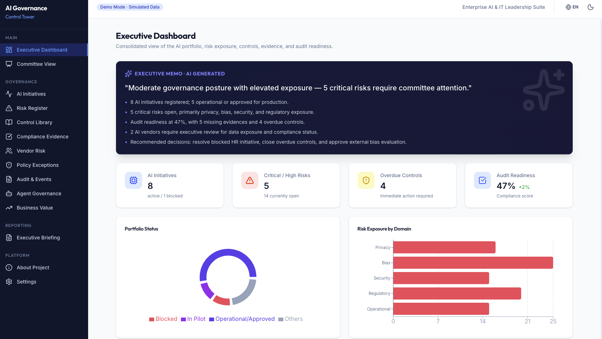
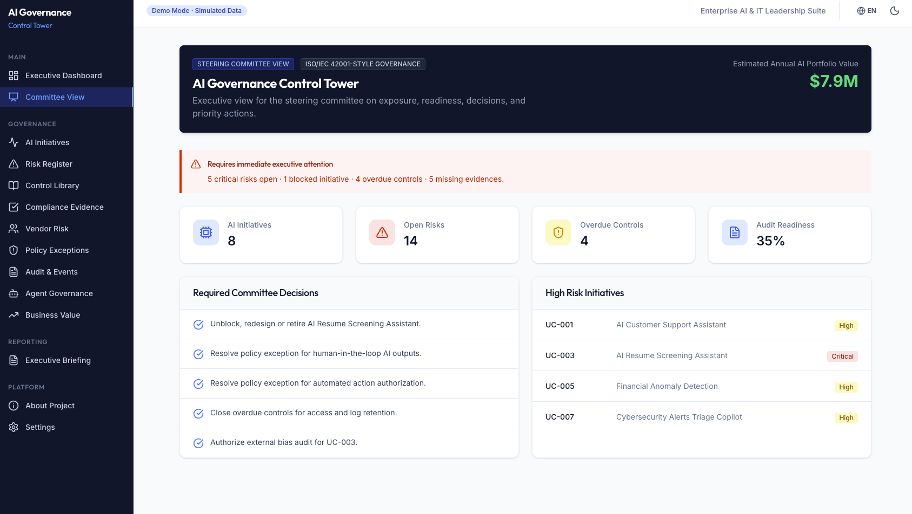
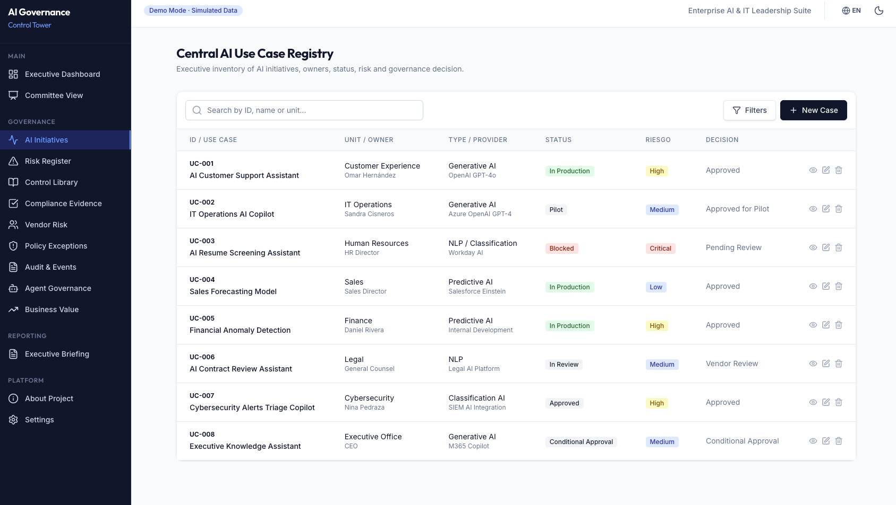
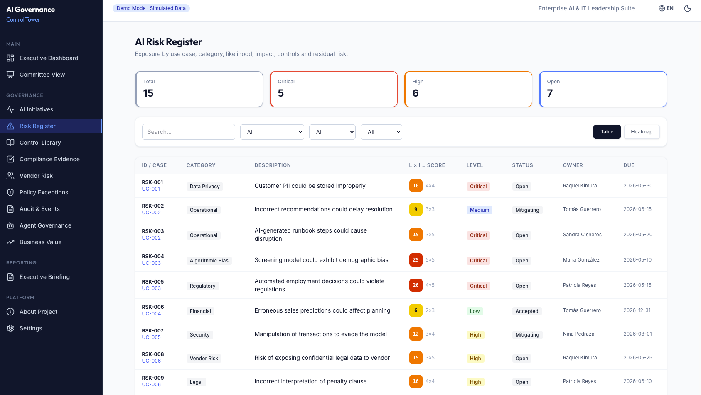
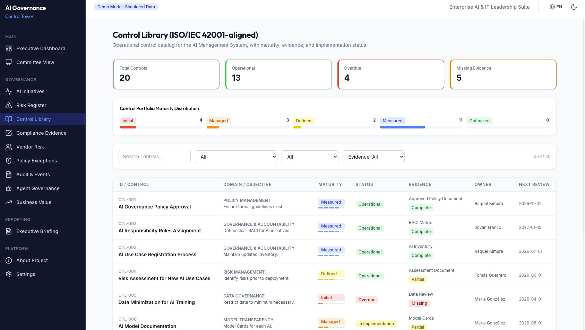
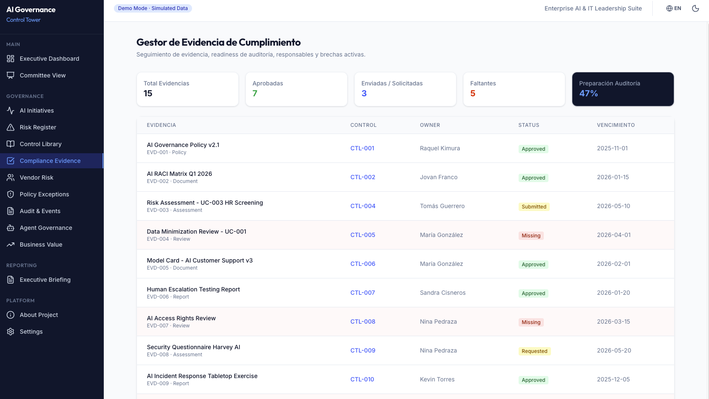
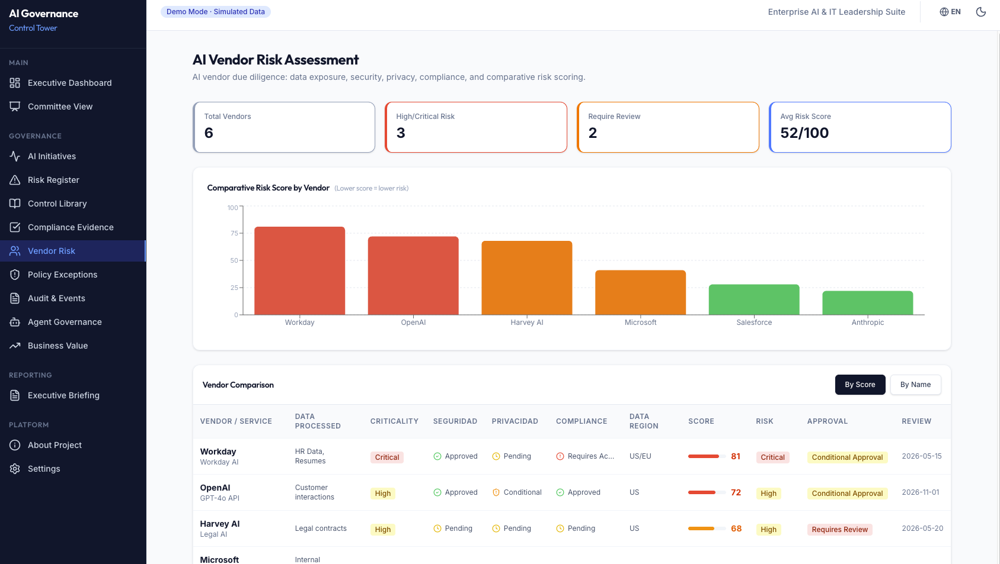
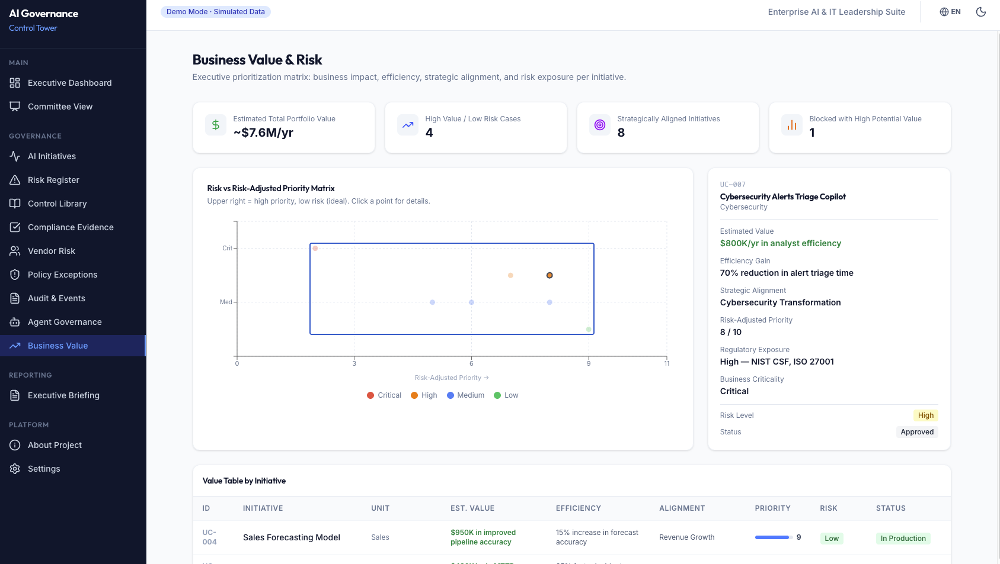
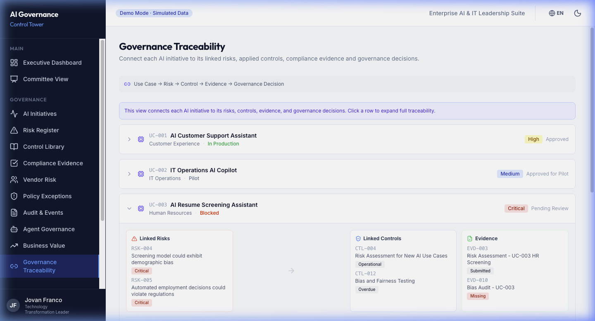
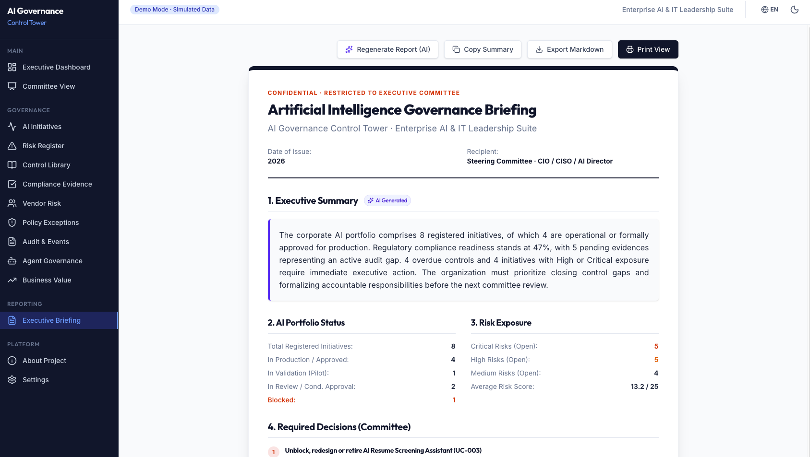

# AI Governance Control Tower

---

## Executive Summary

**AI Governance Control Tower** is an executive portfolio demo designed to demonstrate a visual operating model for enterprise AI governance. It moves governance from static spreadsheets to a dynamic, integrated operational model — covering the full AI initiative lifecycle: intake, risk assessment, executive approval, control monitoring, audit preparation, vendor risk, agent governance, traceability and board-ready reporting.

---

## Live Demo

[Launch Control Tower (Vercel)](https://ai-governance-control-tower.vercel.app)

[Report Issue](https://github.com/jovfranco-tech/ai-governance-control-tower/issues)

---

## Product Screenshots

<b>1. Executive Dashboard</b>

 

<em>AI governance posture, KPIs, risk exposure, maturity snapshot and demo role personas.</em>

<b>2. Committee View</b>

 

<em>Steering committee view for executive attention, required decisions and high-risk initiatives.</em>

<b>3. All Initiatives</b>

 

<em>AI initiative portfolio view for tracking use cases, owners, status, risk tier and business context.</em>

<b>4. Risk Register</b>

 

<em>AI risk register for tracking likelihood, impact, mitigation status, owners and escalation flags.</em>

<b>5. Control Library</b>

 

<em>ISO/IEC 42001-aligned control view for AI Management System governance and audit readiness.</em>

<b>6. Compliance Evidence</b>

 

<em>Evidence readiness tracker for controls, owners, gaps, review status and audit preparation.</em>

<b>7. Vendor Risk</b>

 

<em>Vendor risk assessment for comparing third-party AI exposure, remediation needs and approval status.</em>

<b>8. Business Value</b>

 

<em>Business value view connecting efficiency, strategic alignment, cost avoidance and risk-adjusted prioritization.</em>

<b>9. Governance Traceability</b>

 

<em>Governance traceability view connecting AI use cases, risks, controls, evidence, owners and executive decisions.</em>

<b>10. Executive Briefing</b>

 

<em>Board-ready governance memo with portfolio status, required decisions, risk exposure and print/export.</em>

---

## Key Capabilities

| Persona | Primary Focus |
| :--- | :--- |
| **Technology Executive** | AI portfolio posture, strategic risk and business value alignment |
| **Security & Risk (CISO-adjacent)** | Risk register, vendor risk, agent permissions, overdue controls |
| **AI Governance Lead** | Use case inventory, control library, traceability, policy exceptions |
| **Compliance / Audit** | Evidence tracker, audit readiness, overdue items, exception status |
| **Business Owner** | Initiative ROI, strategic alignment, risk-adjusted prioritization |

---

## Demo Flow

Recommended path for hiring managers, interviewers and executive reviewers:

1. **Executive Dashboard** — AI portfolio posture, KPIs, risk exposure and maturity snapshot.
2. **Committee View** — Decisions required, high-risk initiatives and governance priorities.
3. **All Initiatives** — Use case inventory, risk tiers, owners and business context.
4. **Risk Register** — Risk scoring (L×I), categories, mitigation status and escalation flags.
5. **Control Library** — ISO/IEC 42001-aligned controls with maturity levels and evidence status.
6. **Compliance Evidence** — Audit artifact tracking, gaps and readiness score.
7. **Vendor Risk** — Third-party AI platform assessment, scoring and approval status.
8. **Agent Governance** — Autonomous agent permissions, data access and human-in-the-loop requirements.
9. **Business Value** — Risk-adjusted prioritization scatter plot and initiative value table.
10. **Governance Traceability** — Full chain: Use Case → Risk → Control → Evidence → Decision.
11. **Executive Briefing** — Board-ready governance memo with print and Markdown export.

---

## Core Modules

| Module | Path | Description |
| :--- | :--- | :--- |
| **Executive Dashboard** | `/dashboard` | KPIs, portfolio status, risk exposure, maturity snapshot and demo personas |
| **Committee View** | `/committee` | Board-ready decision view for high-risk initiatives |
| **All Initiatives** | `/use-cases` | Central inventory with risk tier, owner, governance decision and business value |
| **Risk Register** | `/risks` | Risk scoring (L×I), categories, mitigation status and escalation flags |
| **Control Library** | `/controls` | ISO/IEC 42001-aligned control catalog with maturity levels and evidence status |
| **Compliance Evidence** | `/evidence` | Audit artifact tracking, gaps, review status and readiness score |
| **Vendor Risk** | `/vendors` | Third-party AI risk scoring, data residency and approval status |
| **Agent Governance** | `/agents` | Agent permissions, data access, logging, human-in-the-loop and review cadence |
| **Business Value** | `/value` | Efficiency gains, cost avoidance, strategic alignment and risk-adjusted prioritization |
| **Governance Traceability** | `/traceability` | Visual traceability from AI use cases to risks, controls, evidence, owners and executive decisions |
| **Executive Briefing** | `/briefing` | Board-ready governance memo with print and Markdown export |

---

## Why This Project Matters

Most AI governance tooling focuses on isolated data points. This project demonstrates a **connected operating model** — where every AI use case traces to its risks, controls, evidence, owner and governance decision. It bridges the gap between technical AI operations and executive accountability, proving readiness for regulations and frameworks like ISO/IEC 42001, EU AI Act and NIST AI RMF.

---

## Architecture Overview

- **Frontend First:** Built entirely as an SPA to demonstrate high-fidelity UI and rapid prototyping capabilities.
- **State Management:** Utilizes React Context and `localStorage` for robust, session-persistent simulated data.
- **Routing:** Handled cleanly with React Router v7, ensuring quick navigation across executive workflows.
- **Bilingual Core:** Centralized `DataContext` serving English or Spanish localized data seamlessly.

---

## Tech Stack

| Layer | Technology |
| :--- | :--- |
| Framework | React 19 + TypeScript |
| Build | Vite |
| Routing | React Router v7 |
| Styling | Tailwind CSS v4 |
| Charts | Recharts (Pie, Bar, Radar, Scatter) |
| Serverless | Vercel Function (`/api/generate.js`) |
| Deployment | Vercel (CI/CD on push to `main`) |

---

## Language Support

English and Spanish UI support includes navigation, labels, filters, statuses, charts, tooltips and localized demo content for visible governance workflows.

---

## Compliance Disclaimer

This project uses the following positioning:

✅ **Permitted:** ISO/IEC 42001-aligned · AI Management System control view · governance readiness · audit preparation · compliance evidence readiness · simulated enterprise data · portfolio demonstration · executive governance demo

❌ **Not applicable:** ISO certified · guaranteed compliance · official ISO tool · legal compliance platform · production GRC system · replaces legal advice

> ⚠️ This is a portfolio project. It is not a production-ready compliance platform, does not reproduce proprietary standard text, and does not replace legal advisory.

---

## Roadmap

### v1.5.2 (Current)
- [x] **Board-Ready Print & PDF Capable Stylesheets** — Engineered custom `@media print` directives in `src/index.css` to hide sidebars, filter panels, language switchers, and interactive buttons. Automatically formats dashboards, tables, and dossiers into high-contrast letter/A4 grids with clean borders and optimized page breaks.
- [x] **WCAG AA Compliance & Contrast Hardening** — Conducted a thorough contrast audit across all key pages (`Settings.tsx`, `CommitteeView.tsx`, etc.), removing low-contrast utility classes and standardizing high-contrast text ratios for success, warning, and danger badges in both dark and light modes.
- [x] **Resilient Mobile Responsiveness** — Wrapped all data tables with horizontal scroll helpers and enhanced custom responsive layouts, ensuring that Use Case Registries and Details Drawers scale gracefully from 375px mobile screens to large desktop viewports.
- [x] **Professional Security & Simulation Postures** — Added explicit, client-facing disclaimers clarifying simulated AI behavior boundaries and ISO/IEC 42001-inspired alignment, making it fully ready for public portfolio demonstration with zero credentials exposed.
- [x] **Zero-Warning Production Pipeline** — Resolved all TypeScript, ESLint (`no-unused-vars` in `CommitteeView.tsx`), and bundler warnings to achieve a perfectly clean build.

### v1.5.1 (Previous)
- [x] **Fully Dynamic Steering Committee Dashboard** — Upgraded `CommitteeView.tsx` to calculate all key risk, control, initiative, and audit metrics dynamically, removing hardcoded statistics.
- [x] **Reactive Required Decisions Log** — Built dynamic steering committee actions that query active use case statuses dynamically. Unblocking the AI Resume Screening Assistant (`UC-003`) immediately transitions its associated decisions to a green checkmark "RESOLVED" state.
- [x] **Dynamic Settings & Mapped Perspectives** — Redesigned `Settings.tsx` to bind organizational team members to global demo role perspectives. The active user profile dynamically updates upon switching roles.
- [x] **Hardened Local Data Reset** — Hooked up a robust "Reset Demo Data" function in `Settings.tsx` to clear persistent localStorage use cases and active persona perspectives, triggering a clean page reload.
- [x] **Bilingual Terminology Hardening** — Standardized technical Latin American Spanish translations (*supervisión humana / aprobación humana*, *Torre de Control de Gobernanza de IA*, *bitácora de decisiones*, *trazabilidad*, *explicabilidad*) across the application.
- [x] **Visual Design & Contrast Polish** — Polished visual styles, shadows, border contrasts, and layouts for flawless, high-resolution recruiter-ready screenshots.

### v1.5.0 (Previous)
- [x] **Dynamic AI Risk Scoring Engine** — 5-parameter (sensitivity, criticality, autonomy, regulation, user impact) live scoring (0-15 scale) & automatic technical rationale generation.
- [x] **Control Recommendation Engine** — Context-aware ISO/IEC 42001 recommendations linking active company compliance controls and evidence.
- [x] **AI Governance Copilot** — Simulated AI assistant detecting compliance gaps, active blockers, and step-by-step next best actions in real-time.
- [x] **Human-in-the-loop Committee Workflow** — Interactive, state-persistent review panel allowing executives to change status, assign formal decision owners, write rationales, and sync changes instantly with the global dashboard.
- [x] **Active Persona Integration** — Connected demo persona switcher to automatic UI feedback, rendering high-fidelity `"Core"` badges on specific sidebar links and showing top status banners.
- [x] **Resilient Serverless Briefing Generator** — Restructured `/api/generate.js` to return a beautiful, dynamic 3-paragraph executive memo when no OpenAI API Key is present, ensuring 100% demo resilience.
- [x] **Clientside Executive Briefing Fail-safe** — Built-in dynamic clientside briefing engine fallback on `/briefing` with live-context data queries (no hardcoded numbers).

### v1.4.0 (Previous)
- [x] Governance Traceability — Use Case → Risk → Control → Evidence → Decision
- [x] AI Governance Maturity Snapshot (6-dimension ISO/IEC 42001-aligned model)
- [x] Demo Role Personas (simulated perspective selector, no auth)
- [x] Enhanced Executive Briefing with live date, risk score disclaimer and localized output
- [x] Risk scoring explanation with inherent/residual risk, likelihood and impact
- [x] README restructured and Demo Flow consolidated

### v1.3.1 (Previous)
- [x] Business Value view with risk-adjusted prioritization
- [x] Filter panel in Risk Register
- [x] Control maturity progression chart
- [x] Vendor risk comparison table
- [x] Complete bilingual UX (English / Spanish)

### v2.0 (Future / Planned)
- [ ] Real data integration via API adapters (ITSM, GRC, SIEM)
- [ ] Role-based access views (Technology Executive vs CISO vs Compliance)
- [ ] Notification center (overdue controls, expiring exceptions)
- [ ] Automated evidence collection hooks

---

## Changelog

See [CHANGELOG.md](./CHANGELOG.md) for full version history spanning all major and minor releases.

---

## Author

**Jovan Franco**
Technology Transformation Leader · Cloud, Cybersecurity & AI Governance · Enterprise AI Portfolio
[LinkedIn](https://linkedin.com/in/jovfranco) · [GitHub](https://github.com/jovfranco-tech)

---

Part of the Enterprise AI & IT Leadership Suite · Portfolio Project · Simulated Data

