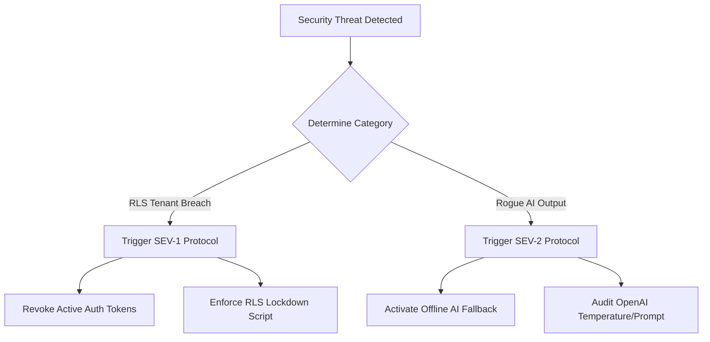

# Incident Response Policy & Procedures

This document defines the emergency workflows, response categories, containment procedures, and post-mortem templates required to mitigate security anomalies, data breaches, or AI compliance incidents.

---

## 1. Incident Severity Levels

| Severity | Definition | Target Containment |
| :--- | :--- | :--- |
| **SEV-1 (Critical)** | RLS tenant isolation failure, credential leak, or unauthorized database write access. | **< 30 Minutes** |
| **SEV-2 (High)** | LLM cost spikes, rogue AI-generated technical recommendations, or rate limiter failures. | **< 2 Hours** |
| **SEV-3 (Medium)** | Localized dashboard state loading errors or minor responsive layout issues. | **< 24 Hours** |

---

## 2. Emergency Escalation Workflows



### 2.1 Scenario A: Row-Level Security (RLS) Tenant Isolation Failure (SEV-1)
1. **Detection:** Structured JSON Logger triggers a `CRITICAL` log flag for an RLS violation.
2. **Containment:**
   * **Step 1:** Revoke active auth tokens for all sessions associated with the compromising IP or tenant node.
   * **Step 2:** Force database lockdown by locking transaction schemas:
     ```sql
     ALTER TABLE public.ai_use_cases FORCE ROW LEVEL SECURITY;
     ```
3. **Investigation:** Query the `audit_events` log to track the entry vector and data tables touched.

### 2.2 Scenario B: Rogue AI/LLM Recommendation Out of Bounds (SEV-2)
1. **Detection:** User reports hallucinated risk justifications or compliance policy recommendations that do not match the evaluation bounds.
2. **Containment:**
   * **Step 1:** Activate "Offline AI Fallback Mode" via env config (`VITE_AI_MODE=simulated`) to decouple the backend LLM service.
   * **Step 2:** Refine system prompt templates and reset completion parameters (e.g. adjust OpenAI temperature downwards to `0.1` to increase deterministic formatting).

---

## 3. Communication Templates

### 3.1 Customer Notification Template (For SEV-1 breaches)
```markdown
Subject: Security Notification regarding your AI Governance Control Tower account

Dear [Customer Administrator],

We are contacting you to outline a security incident detected by our DevSecOps automated monitoring system on [Date] at [Time]. 

Our database Row-Level Security isolation gateway intercepted an unauthorized data request attempt. Immediate containment countermeasures were deployed within 15 minutes, isolating the database session and locking schemas.

Our logs confirm that:
- Your core use-case registry profiles [were/were not] exposed.
- No real customer PII or corporate assets were compromised.

We have applied preventative structural RLS checkpoints and are monitoring traffic. No action is required on your part.

Sincerely,
Security Response Team
```

---

## 4. Post-Incident Review (PIR) Template

Each SEV-1 incident requires publishing a PIR containing:
- **Incident Summary:** Date, timeline, duration, and user impact.
- **Root Cause Analysis (RCA):** Explaining the precise gateway/query error that allowed the anomaly.
- **Action Items Checklist:** Actionable engineering items (e.g. updating auth checks, adding test coverage) to prevent recurrence.
