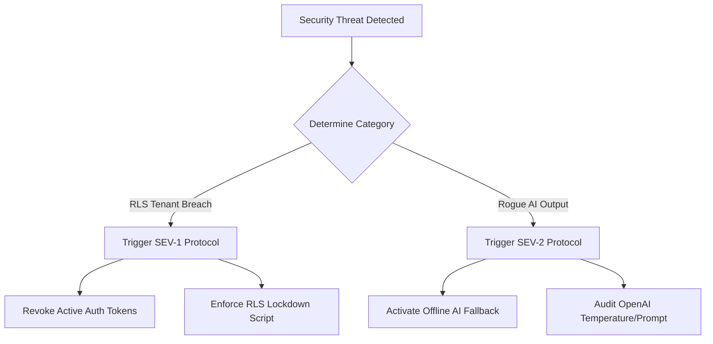

# Incident Response Policy & Procedures

This document defines the emergency workflows, response categories, containment procedures, and post-mortem templates required to mitigate security anomalies, data breaches, or AI compliance incidents in the **AI Governance Control Tower** platform.

---

## 1. Incident Severity Levels & Matrix

We categorize security and operational incidents into three distinct tiers:

| Severity | Definition | Containment SLA | Typical Scenarios |
| :--- | :--- | :--- | :--- |
| **SEV-1 (Critical)** | RLS tenant isolation failure, credential leak, or unauthorized database write access. | **< 30 Minutes** | Cross-tenant data discovery, database hijack, exposed Supabase key. |
| **SEV-2 (High)** | LLM cost spikes, rogue AI-generated technical recommendations, or rate limiter failures. | **< 2 Hours** | Endpoint DDoS attacks, AI hallucinations violating ISO 42001, rate limiter failure. |
| **SEV-3 (Medium)** | Localized dashboard state loading errors or minor responsive layout issues. | **< 24 Hours** | UI rendering lags, minor bilingual translation mismatches, print formatting errors. |

---

## 2. DevSecOps Response Scenarios



### 2.1 Scenario A: Row-Level Security (RLS) Tenant Isolation Failure (SEV-1)
* **Threat Profile:** Unauthorized data read/write attempts across tenant boundary organizations.
* **Containment:**
  1. **Immediate Revocation:** The administrator calls the auth revoke endpoint to cancel all active sessions associated with the compromising IP address.
  2. **Force SQL Lockdown:** Force database table constraints by locking tables to strict RLS:
     ```sql
     ALTER TABLE public.ai_use_cases FORCE ROW LEVEL SECURITY;
     ```
  3. **Audit Event Verification:** Inspect the `public.audit_events` table for logs under category `DATABASE` matching the anomalous `user_id` to assess exposure.

### 2.2 Scenario B: LLM Cost Spikes & Completion Abuse (SEV-2)
* **Threat Profile:** Sudden exponential rise in AI endpoint calls, indicating potential DDoS or script-loop attacks on Vercel AI routes.
* **Containment:**
  1. **API Key Quarantine:** Rotate the active `OPENAI_API_KEY` on the Vercel dashboard and restart the serverless deployments to drop queued threads.
  2. **Activate Safe Fallback:** Set the active server env `AI_MODE=mock`. Backend routes will instantly start executing the deterministic mock provider locally within 10ms, dropping OpenAI network fees to $0.
  3. **Assess Quotas:** Verify that the in-memory rate-limiter provider successfully flagged and returned HTTP `429` statuses to the offending client IP and org ID.

### 2.3 Scenario C: Rogue AI/LLM Recommendation Out of Bounds (SEV-2)
* **Threat Profile:** LLM returns hallucinated risk scoring justifications or compliance recommendations that violate ISO 42001 thresholds or leak sensitive data.
* **Containment:**
  1. **Downgrade Temperature:** Lower completion temperatures in `api/ai/` routes (e.g. from `0.5` down to `0.1`) to restrict outputs to highly deterministic formats.
  2. **Review Guardrails Log:** Verify that `src/lib/ai/guardrails.ts` successfully identified schema mismatches and returned the safe structural fallback.

---

## 3. Post-Incident Review (PIR) Template

All SEV-1 and SEV-2 incidents must publish a formal post-mortem review inside the repository within 24 hours of system restoration:

```markdown
# POST-INCIDENT REVIEW (PIR)

## Incident Reference: [INCIDENT-ID]
* **Incident Commander:** [Name]
* **Date & Time of Outage:** [YYYY-MM-DD HH:MM UTC]
* **Date & Time of Resolution:** [YYYY-MM-DD HH:MM UTC]
* **Total Downtime (RTO):** [X Hours, Y Minutes]
* **Data Loss Duration (RPO):** [Z Minutes]

## Executive Summary
Brief summary of the incident, customer-facing impacts, and restoration actions.

## Timeline of Events
* **HH:MM** - Incident detected via health diagnostic endpoint alerting system.
* **HH:MM** - Incident commander mobilized.
* **HH:MM** - Failover initiated or endpoint quarantined.
* **HH:MM** - System sanity checks completed.
* **HH:MM** - Normal operations restored.

## Root Cause Analysis (RCA)
Detailed technical description of why the failure occurred.

## Action Items & Preventative Measures
* [ ] Fix [RCA source] in CI/CD pipeline.
* [ ] Adjust rate limiting threshold window in Vercel config.
* [ ] Run simulated database restoration fire-drill.
```
